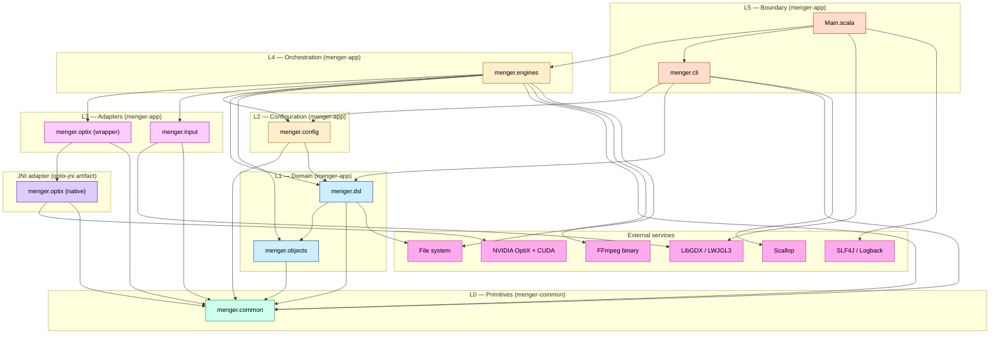

# Architecture: Modules, Layers, Interfaces, External Services

**Last updated:** 2026-05-22
**Branch:** `feature/tooling-static-analysis`

Single-page snapshot of Menger's onion-layer architecture: sbt modules,
layer ordering, and the canonical dependency diagram. The detailed
per-package interface contracts, external-services contracts, and the
catalogue of accepted violations have been promoted into arc42 and are
linked from here.

The layering is enforced by `ArchitectureSpec` and
`ArchitecturePhase2Spec` in `menger-app/src/test/scala/menger/`. See
[arc42 §9 AD-23](arc42/09-architectural-decisions.md) for the
enforcement decision and the currently-accepted technical debt.

---

## 1. sbt modules

The build is a three-module sbt project:

| Module | Package roots | Role |
|--------|---------------|------|
| `menger-common` | `menger.common.*` | Domain primitives, pure Scala. No third-party deps beyond stdlib. |
| `optix-jni` | `menger.optix.*` (production sources only) | JNI adapter for NVIDIA OptiX. Native C++/CUDA build via CMake. Intended for future extraction as a standalone artifact for any JVM consumer. |
| `menger-app` | `menger.{objects,dsl,config,input,engines,cli,optix}.*` plus root `menger.*` | The application — geometry, scene DSL, config, input, engines, CLI entry. Also hosts a thin `menger.optix` wrapper that adapts the JNI module to the engines. |

`menger-common` is shared by `optix-jni` and `menger-app`. `menger-app`
depends on `optix-jni`. There are no other inter-module compile
dependencies.

---

## 2. Layers (onion ordering)

Dependencies must point inward only — outer layers may import from inner
layers, never the reverse.

| Layer | Packages | Module | Purpose |
|------:|----------|--------|---------|
| L0 | `menger.common` | `menger-common` | Shared primitive types. The most stable layer. |
| L1 | `menger.objects`, `menger.dsl` | `menger-app` | Pure geometry and the scene-description DSL. |
| L2 | `menger.config` | `menger-app` | Configuration case classes assembled from CLI input and DSL output. |
| L3 | `menger.optix` (wrapper), `menger.input` | `menger-app` | Ports / adapters. The wrapper adapts the JNI module to engines; `menger.input` adapts LibGDX. |
| L4 | `menger.engines` | `menger-app` | Orchestration of the render loop, animation, video export. |
| L5 | `menger.cli`, `Main.scala` | `menger-app` | Application boundary — argument parsing and process entry. |
| ext | `menger.optix.*` (native) | `optix-jni` | External adapter: native OptiX/CUDA bindings. |
| ext | LibGDX, LWJGL3 | external jars | External adapter: windowing and input. |

Two root-level packages exist that have not yet been migrated into the
layers above and should be re-homed (see CODE_IMPROVEMENTS.md
`M-arch-config-naming`): `menger.ProfilingConfig`, `menger.ObjectSpec`,
`menger.AnimationSpecification*`, `menger.RenderState`,
`menger.RotationProjectionParameters`, `menger.TextureLoader`,
`menger.Vector3Extensions`, `menger.ColorConversions`.

---

## 3. Module purpose and interface

The per-package interface tables (purpose, exposed types, allowed
dependencies, known violations) have moved to the arc42 building-block
view, which is the canonical source going forward.

→ See [arc42 §5.2 Package-Level Components](arc42/05-building-block-view.md#52-level-2-package-level-components).

---

## 4. External services

The external-services boundary table (OptiX/CUDA, LibGDX/LWJGL3,
FFmpeg, file system, SLF4J/Logback, Scallop, ArchUnit) has moved to the
arc42 context view.

→ See [arc42 §3.2 Technical Context — External Services](arc42/03-context-and-scope.md#external-services).

---

## 5. Layered dependency diagram

Solid edges are compile-time imports. Edges that target an
external-services node are runtime calls to that service. The same
diagram is reproduced inline in
[arc42 §5.5](arc42/05-building-block-view.md#55-layered-dependency-diagram).

---

## 6. Known layering violations

The catalogue of currently-accepted layering violations (the five
`M-arch-*` entries: `M-arch-config-naming`, `M-arch-dsl-layer`,
`M-arch-dsl-mutable`, `M-arch-objects-logging`,
`M-arch-archunit-case-class-field`) lives in:

- [`CODE_IMPROVEMENTS.md`](../CODE_IMPROVEMENTS.md) — the work backlog.
- [arc42 §9 AD-23](arc42/09-architectural-decisions.md) — the decision
  rationale and the table mapping each ID to the `@Ignore`d rule.
