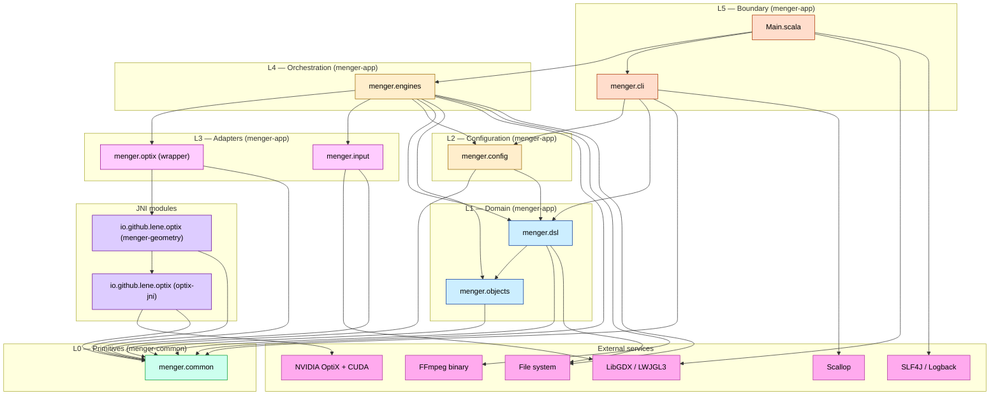

# 5. Building Block View

## 5.1 Level 1: System Overview

```
┌─────────────────────────────────────────────────────────────────────┐
│                           Menger System                              │
├─────────────────────────────────────────────────────────────────────┤
│                                                                      │
│  ┌──────────────┐  ┌──────────────┐  ┌──────────────┐              │
│  │              │  │              │  │              │               │
│  │  menger-app  │  │menger-geometry│  │  optix-jni   │               │
│  │ (Application)│  │ (4D/caustics)│  │(Ray Tracing) │               │
│  │              │  │  not published│  │  published   │               │
│  └──────┬───────┘  └──────┬───────┘  └──────┬───────┘               │
│         │                 │                  │                       │
│         └─────────────────┴──────────────────┘                       │
│                                 │                                    │
│                                 ▼                                    │
│                    ┌────────────────────────┐                        │
│                    │     menger-common      │                        │
│                    │   (Shared utilities)   │                        │
│                    │       published        │                        │
│                    └────────────────────────┘                        │
│                                                                      │
└─────────────────────────────────────────────────────────────────────┘
```

## 5.2 Level 2: Package-Level Components

Each package below names the **interface** types neighbouring packages
depend on, the allowed inward dependencies, and any currently-accepted
violations (tracked in `CODE_IMPROVEMENTS.md` as `M-arch-*`). See §5.5
for the layered diagram and AD-23 (§9) for the enforcement mechanism.
All ArchUnit rules are active — no `@Ignore` annotations remain.

### 5.2.1 `menger.common` (L0 — external published artifact `io.github.lene:menger-common`)

| Aspect | Detail |
|--------|--------|
| Purpose | Pure data types shared by every other layer. The most stable layer. |
| Interface | `Color`, `Vec3`, `Vector[N]`, `ImageSize`, `Light`, `Axis`, `PlaneSpec`, `PlaneColorSpec`, `FogSpec`, `FogConfig`, `TriangleMeshData`, `ObjectType`, `Const`, `Patterns`, `InputEvent`, `MengerException` and subtypes. |
| Allowed dependencies | Java/Scala stdlib only. |
| Known violations | None. |

`SceneSpecs` (Axis, PlaneSpec, PlaneColorSpec, FogSpec) and `FogConfig`
were promoted into `menger.common` so the DSL and CLI can share them
without crossing layer boundaries.

### 5.2.2 `menger.objects` (L1 — `menger-app`)

| Aspect | Detail |
|--------|--------|
| Purpose | Fractal geometry generation; analytical primitives; 4D polytopes. |
| Interface | `Geometry` trait, `Builder` trait, `Composite`, all primitive case classes (`Cube`, `Sphere`, `Cone`, `Tetrahedron`, `Octahedron`, `Dodecahedron`, `Icosahedron`), `SpongeBySurface`, `SpongeByVolume`, `FractionalLevelSponge`, `ParametricTessellator`, `higher_d.{Tesseract, Pentachoron, Hexadecachoron, Icositetrachoron, Hecatonicosachoron, Hexacosichoron, TesseractSponge, TesseractSponge2, Mesh4D, RotatedProjection}`. |
| Allowed dependencies | `menger.common`. |
| Known violations | 4 classes import SLF4J (`M-arch-objects-logging`). |

**CoordinateCross** (Sprint 19.5): Not a `SceneObject`. Rendered as three
analytical cylinders along the X, Y, Z axes from the origin. Controlled
via `--cross*` CLI flags and the 'C' key in interactive mode.

### 5.2.3 `menger.dsl` (L1 — `menger-app`)

| Aspect | Detail |
|--------|--------|
| Purpose | Scala DSL for scene description. Builds DSL types that the converter turns into engine configs. |
| Interface | `Scene`, `SceneObject` (case classes: `Sphere`, `Cube`, `Sponge`, `Tesseract`, `TesseractSponge`, `ParametricSurface`, `Plane`, with `rotation: Vec3`, `normalMap`, `roughnessMap`, `proceduralType`, `proceduralScale`), `Fog`, `Camera`, `Light` (point / directional / area), `Material`, `Color`, `Vec3`, `Placement`, `Transform`, `Caustics`, `RenderSettings`, `CameraPath`, `SceneLoader`, `SceneRegistry`, `SceneCompiler`, `LoadedScene`. |
| Allowed dependencies (target) | `menger.common`, `menger.objects`. |
| Known violations | `SceneConverter` imports `menger.config` and `menger.optix`; `Material` imports `menger.optix.Material`; `SceneRegistry` uses `concurrent.TrieMap` (`M-arch-dsl-layer`, `M-arch-dsl-mutable`). |

### 5.2.4 `menger.config` (L2 — `menger-app`)

| Aspect | Detail |
|--------|--------|
| Purpose | Case-class configuration types passed from the CLI/DSL down into engines. |
| Interface | `CameraConfig`, `SceneConfig`, `EnvironmentConfig`, `ExecutionConfig`, `OptiXEngineConfig`, `PlaneConfig`, `MaterialConfig`, `CrossConfig`. |
| Allowed dependencies | `menger.common`, `menger.dsl`. May reference `menger.optix.Material` because `PlaneConfig`/`MaterialConfig` carry render-time material data — accepted as a controlled cross-cut. |
| Known violations | Five misplaced `*Config` types still live under `engines`/`input`/`optix`/root (`M-arch-config-naming`). |

`PlaneConfig` was moved here from `menger.cli` so engines and the DSL can
share the configuration type without depending on the CLI layer.

### 5.2.5 `menger.optix` (L3 wrapper — `menger-app`)

| Aspect | Detail |
|--------|--------|
| Purpose | Adapter from the JNI module to engine-friendly types. Owns the renderer lifecycle. |
| Interface | `OptiXRendererWrapper` (`extends AutoCloseable` — Sprint 20 lifecycle hardening), `SceneConfigurator` (camera, lights, fog, background), `CameraState`. |
| Allowed dependencies | `menger.common`, `optix-jni` types. Must not depend on `menger.engines`, `menger.config`, `menger.cli`, `menger.dsl`. |
| Enforced rules | No LibGDX imports (`ArchitectureSpec`). No `native` methods (those live only in `optix-jni`). |

### 5.2.6 `menger.input` (L3 adapter — `menger-app`)

| Aspect | Detail |
|--------|--------|
| Purpose | Adapter for LibGDX input + GDX runtime lifecycle. All `var`/`null` mutable LibGDX surface area lives here (see §2.5 and AD-7). |
| Interface | `InputHandler`, `KeyHandler` family (`GdxKeyHandler`, `OptiXKeyHandler`, `PreviewKeyHandler`, `KeyRotation`), `EventDispatcher`, `OrbitCamera`, `SphericalOrbit`, `KeyPressTracker`, `GdxRuntime`, `LibGDXInputAdapter`, `LibGDXConverters`, `OptiXCameraHandler`, `OptiXInputMultiplexer`. |
| Allowed dependencies | `menger.common`, `menger.optix` (wrapper), LibGDX. Must not depend on `menger.engines`, `menger.dsl`, `menger.config`. |

Renamed from the former `menger` `gdx` subpackage in Sprint 21 to reflect
its role as the input / windowing adapter rather than a generic LibGDX
namespace. `DragTracker` was folded into `OrbitCamera`'s `dragState`
(see §2.5.2).

### 5.2.7 `menger.engines` (L4 — `menger-app`)

| Aspect | Detail |
|--------|--------|
| Purpose | Render-loop orchestration: interactive, preview, animation, video export. Bridges DSL/config/input/optix into a running engine. Writes per-frame render statistics as JSON on exit (`--stats-json`). |
| Interface | `RenderEngine` trait, `BaseEngine`, `InteractiveEngine`, `PreviewEngine`, `AnimationEngine`, `CliAnimationEngine`, `VideoEngine`, `RenderModeSelector`, `GeometryRegistry`, `PlaneConfigurer` (extracted from `optix.SceneConfigurator`), `VideoEncoder`, `WithAnimation` / `WithPreview` / `WithVideoExport` traits, `scene.SceneBuilder` strategy family (`SphereSceneBuilder`, `ConeSceneBuilder`, `PlaneSceneBuilder`, `CubeSpongeSceneBuilder`, `TriangleMeshSceneBuilder`, `TesseractEdgeSceneBuilder`, `Menger4DSceneBuilder`, `Sierpinski4DSceneBuilder`, `Hexadecachoron4DSceneBuilder`, `MaterialExtractor`, `MeshFactory`, `MeshUploadPlan`, `TextureManager`). |
| Allowed dependencies | All inner layers; LibGDX (via `menger.input`); FFmpeg (via `VideoEncoder`). |
| Known violations | None active. |

### 5.2.8 `menger.cli` + `Main.scala` (L5 — `menger-app`)

| Aspect | Detail |
|--------|--------|
| Purpose | Process boundary. Parses CLI args, builds configs, hands off to an engine. The sole permitted exit path is `MengerExitException`, caught in `Main.scala` (no other `sys.exit` calls). |
| Interface | `MengerCLIOptions` (Scallop), `CliTypes` (re-exports common/config types), `CliValidation`, `cli.converters.*`, `Main.main`. |
| Allowed dependencies | `menger.common`, `menger.config`, `menger.dsl`, `menger.engines` (for `Main` only), Scallop. |
| Enforced rules | `menger.cli` itself must not depend on `menger.engines` or `menger.optix` (`ArchitecturePhase2Spec`). `Main` may. |

### 5.2.9 `optix-jni` module (published — `io.github.lene.optix`)

| Aspect | Detail |
|--------|--------|
| Purpose | Generic GPU ray tracing library. NVIDIA OptiX/CUDA JNI bindings; PTX shaders for sphere and generic geometry. No Menger-specific types. Published as `io.github.lene:optix-jni`. |
| Interface | `OptiXRenderer` (thin class — mixes in five `private[optix]` API traits — `OptiXSphereApi`, `OptiXMeshApi`, `OptiXPlaneApi`, `OptiXTextureApi`, `OptiXRenderApi`; holds `@volatile nativeHandle: Long`; exposes final-frame denoising through `setDenoisingEnabled`), `NativeOptiXApi` (thin context/module/pipeline/denoiser lifecycle), `OptiXDenoiser`, `Material`, `RenderConfig`, `RenderLimits`, `RenderHealth`. |
| Allowed dependencies | `menger-common`, JDK only. No LibGDX, no Scala-specific types in public method signatures. |
| Enforced rules | `loadLibrary` and `native` methods in `optix-jni` or `menger-geometry` only (`ArchitectureSpec`). Java-friendly API surface (no `scala.Option`, `scala.collection`, etc. on public methods). |

**Native sources** live in the external repository
`github.com/lene/optix-jni`. Sprint 29.2 temporarily pins a source dependency to
commit `c618caf` until the Sprint 29.6 release publishes the denoiser API. The
published jar contains runtime resources
(`native/x86_64-linux/liboptixjni.so`, `native/x86_64-linux/optix_shaders.ptx`)
and native development resources (`optix-jni-native/include/**`,
`optix-jni-native/shaders/**`) consumed by `menger-geometry`.

### 5.2.10 `menger-geometry` module (in-repo — `io.github.lene.optix`)

| Aspect | Detail |
|--------|--------|
| Purpose | Menger-specific 4D geometry, caustics, and video-frame loading extension of `optix-jni`. Not published. |
| Interface | `MengerRenderer` (extends `OptiXRenderer`; overrides all 4D geometry `@native` methods to dispatch to `libmengergeometry.so`), `VideoLoader` (Scala/JNI wrapper; decodes video frames from `.mp4`/`.mkv` via libav; returns raw RGBA byte arrays for GPU texture upload — Sprint 27 skeleton). |
| Allowed dependencies | `optix-jni`, `menger-common`. |
| Enforced rules | `@native` methods and `loadLibrary` permitted here (same ArchUnit rule as `optix-jni`). |
| Native dependency handling | `menger-geometry/build.sbt` extracts `optix-jni-native/**` from the `optix-jni` dependency jar or source-dependency resource directories into `target/optix-jni-native-api` and passes those include/shader directories to CMake. |

**Native sources** (`menger-geometry/src/main/native/`): `MengerJNIBindings.cpp`
(4D geometry JNI dispatch), `CausticsRenderer.{h,cpp}`, `Project4D.{h,cu}`.
Shaders: `hit_menger4d.cu`, `hit_sierpinski4d.cu`, `hit_hexadecachoron4d.cu`,
`caustics_ppm.cu`, `optix_shaders_menger.cu` (umbrella). `MengerParams.h`
extends `BaseParams` with 4D geometry fields.

## 5.3 OptiX JNI Architecture (Level 3)

### Two-Layer Design

```
┌─────────────────────────────────────────────────────────────────────┐
│                         Scala Layer                                  │
│  ┌──────────────────────────────────────────────────────────────┐   │
│  │  OptiXRenderer  (thin class — mixes in 5 responsibility       │   │
│  │  traits, holds nativeHandle)                                  │   │
│  │   ├── OptiXSphereApi   — sphere add/configure                 │   │
│  │   ├── OptiXMeshApi     — triangle mesh upload/configure       │   │
│  │   ├── OptiXPlaneApi    — plane add/configure                  │   │
│  │   ├── OptiXTextureApi  — texture upload, procedural, PBR maps │   │
│  │   └── OptiXRenderApi   — render, camera, lights, scene mgmt   │   │
│  └──────────────────────────────────────────────────────────────┘   │
└────────────────────────────────┬────────────────────────────────────┘
                                 │ JNI
┌────────────────────────────────▼────────────────────────────────────┐
│                         C++ Layer                                    │
│  ┌──────────────────────────────────────────────────────────────┐   │
│  │  OptiXWrapper (High-Level)                                    │   │
│  │  - Scene state management                                     │   │
│  │  - Convenience methods (setSphere, setCamera, render)         │   │
│  │  - Performance optimization (data in Params)                  │   │
│  └─────────────────────────────┬────────────────────────────────┘   │
│                                │ uses                                │
│  ┌─────────────────────────────▼────────────────────────────────┐   │
│  │  OptiXContext (Low-Level)                                     │   │
│  │  - Pure OptiX API wrapper                                     │   │
│  │  - Stateless, explicit resource management                    │   │
│  │  - 1:1 mapping to OptiX functions                             │   │
│  └──────────────────────────────────────────────────────────────┘   │
└─────────────────────────────────────────────────────────────────────┘
```

### Key Data Structures

| Structure | Location | Purpose |
|-----------|----------|---------|
| `BaseParams` | `optix-jni`: `OptiXData.h` | Launch parameters (scene, camera, lights) |
| `MengerParams` | `menger-geometry`: `MengerParams.h` | Extends `BaseParams` with 4D geometry fields |
| `HitGroupData` | `optix-jni`: `OptiXData.h` | Per-geometry SBT data |
| `Light` | `optix-jni`: `OptiXData.h` | Light source definition |
| `RayStats` | `optix-jni`: `OptiXData.h` | Ray tracing statistics |

## 5.4 Input Handling

```
menger.input/  (in menger-app — formerly the menger gdx subpackage)
├── EventDispatcher           # Publishes rotation/projection/eyeW events
├── InputHandler              # Abstract base keyboard+mouse handler
├── KeyHandler                # Abstract keyboard handler (uses KeyPressTracker)
├── GdxKeyHandler             # LibGDX keyboard controls (3D rotation, zoom)
├── OptiXKeyHandler           # OptiX keyboard: 4D rotation, ESC resets 4D view
├── KeyRotation               # Per-key rotation accumulation
├── PreviewKeyHandler         # Preview-mode keyboard handler
├── OptiXCameraHandler        # Camera + 4D controls: Shift+Scroll adjusts eyeW
├── SphericalOrbit            # Spherical camera orbit logic
├── OrbitCamera               # Spherical orbit wrapping mutable LibGDX Vector3
├── GdxRuntime                # LibGDX lifecycle and exit
├── KeyPressTracker           # Shift/Ctrl/Alt + per-key modifier state
├── LibGDXConverters          # Adapter helpers between LibGDX types and menger.common
├── LibGDXInputAdapter        # Mengers' LibGDX InputAdapter implementation
└── OptiXInputMultiplexer     # Combines OptiX input processors
```

**Pattern:** Observer pattern for 4D parameter changes. `EventDispatcher`
notifies geometry objects of `RotationProjectionParameters` changes
(rotation angles and `eyeW`). All mutable state (`var`, `null`) is
delegated to `menger.input` wrapper classes (see §2.5 and AD-7).

## 5.5 Layered Dependency Diagram

The diagram below is the canonical onion-layer view enforced by
`ArchitectureSpec` / `ArchitecturePhase2Spec`. Solid edges are
compile-time imports. Edges that target an `External services` node are
runtime calls to that service.


