# Feature Dependency Map

**Last Updated:** 2026-06-10
**Status:** Feature planning round complete: brainstormed, dependencies mapped, open
questions resolved (§5), priorities selected and sprint plans written (§0)
**Companion:** [BACKLOG_FEATURES.md](BACKLOG_FEATURES.md) — detailed specifications
and task-level estimates for every item evaluated but not scheduled

---

## 0. Prioritization Outcome (2026-06-10)

Selected for the next sprints, in user priority order: finish Sprint 27, F14, F13
(both phases, F1 included as Phase 1), F9, F4, T-PBRTEX, F16. All other candidates
moved to the ROADMAP backlog ("Evaluated 2026-06-10, not prioritized").

The previously planned Sprints 28–31 were pushed back and renumbered. **Sprint-task
IDs in this document (S28.x–S31.x) refer to the pre-renumbering plans** — mapping:

| This document | Renumbered to | Focus |
|---------------|---------------|-------|
| S28.x | Sprint 35 | Visual Quality (DoF, wireframe) |
| S29.x | Sprint 36 | Data Visualization I |
| S30.x | Sprint 37 | 4D Geometry II |
| S31.x | Sprint 38 | Advanced Geometry |

New sprint sequence: 28 = F14 Release & QA, 29 = F13 Phase 1 (denoiser + curves),
30 = F13 Phase 2 (motion blur, API audit, 1.0 prep), 31 = F9 L-systems,
32 = F4 spectral dispersion, 33 = T-PBRTEX PBR texture sets,
34 = F16 production caustics (incl. dispersive caustics, which needs Sprint 32).
Full plans in `SPRINT28.md`–`SPRINT34.md`.

Dependency notes honored by this ordering: curves (Sprint 29) land before L-systems
(Sprint 31); dispersion (Sprint 32) lands before dispersive caustics (Sprint 34);
QA hardening (Sprint 28) front-loads so every later sprint ships through it.
**Purpose:** Dependency-aware catalog of all planned, backlogged, and newly proposed
features. Items that are dependencies for others are identified so they can be
scheduled first. Next step: generate full sprint plans from this list.

Sources merged here:

- Scheduled sprint plans (Sprints 27–31, see `ROADMAP.md` and `SPRINTxx.md` files)
- `ROADMAP.md` long-term backlog
- `TODO.md` unscheduled ideas
- New feature candidates from the 2026-06-10 brainstorming session

**Legend:**

- **Hard dep** (→): cannot reasonably start before the dependency is done
- **Soft dep** (~): substantially easier/better after the dependency; co-design advised
- Effort is in sprints (1 sprint ≈ 15–30h, matching historical velocity)

---

## 1. Item Catalog

### 1.1 Scheduled sprint tasks (already planned)

| ID | Item | Sprint | Status | Depends on | Enables |
|----|------|--------|--------|------------|---------|
| S27.1 | ffmpeg/libav CMake dependency | 27 | ✅ Complete | — | F6 (audio decode/mux uses same libav) |
| S27.2–27.5 | VideoLoader, JNI, DSL VideoTexture, static frame | 27 | In progress | S27.1 | S27.6 |
| S27.6 | Animated video texture updates (in-place GPU texture update API) | 27 | Open — blocked on optix-jni `updateTexture` release | S27.5 | **F11 desktop lens**, S27.8 |
| S27.7–27.9 | EnvMapVideo, 360° backgrounds, memory bounds | 27 | Open | S27.6 | T-360MOVIE |
| S27.10–27.12 | Docs + code-health fixes | 27 | Open | — | — |
| S28.1 | Depth of field (lens sampling) | 28 | Planned | — | ~F1 (DoF noise wants denoising) |
| S28.2 | Wireframe rendering (edge cylinders) | 28 | Planned | — | ~F10 (streamtubes), ~T-HOPF (fiber tubes) |
| S29.1 | Colormaps / color by intensity | 29 | Planned | — | S29.2, S29.3, F10, F19 (coloring) |
| S29.2 | Scalar field GPU evaluation + isosurfaces | 29 | Planned | S29.1 | **F10 vector fields**, B-DATASETS, T-CFUNC |
| S29.3 | Volume rendering (ray marching) | 29 | Planned | S29.1 (transfer functions), ~S29.2 | **F15 god rays** (shared media marching), ~F21, B-DATASETS |
| S30.1 | 4D parametric surfaces `f(u,v)→Vec4` on GPU | 30 | Planned | — | S30.2, **T-SOR**, T-CFUNC, ~B-ROTOPES |
| S30.2 | Parametric specializations (spherical harmonics) | 30 | Planned | S30.1 | T-SOR (same specialization mechanism) |
| S30.3 | DSL integration for parametric surfaces | 30 | Planned | S30.1 | — |
| S31.1 | Sponge cutaways (clipping planes) | 31 | Planned | — | ~F2 (4D slicing reuses clipping concepts) |
| S31.2 | Schläfli polytope generator | 31 | Planned | — | S31.3, **T-STAR**, **B-WYTHOFF** |
| S31.3 | Fractal subdivision on polychora | 31 | Planned | S31.2 | — |

### 1.2 New feature candidates (brainstorm 2026-06-10)

User priority signals from the brainstorm rounds are noted where given.

| ID | Item | Effort | Depends on | Enables | Notes |
|----|------|--------|------------|---------|-------|
| F1 | AI denoising (OptiX denoiser) | 0.5–1 | — | **F17**, ~F8, ~S28.1, ~F15, ~F4, ~B-SSS | DLSS-RR evaluated and rejected (game-engine shape). **Decided: implemented as Phase 1 of F13.** |
| F2 | 4D cross-sections (w-slicing) | 1 | ~S31.1 | — | **Low priority** per user. |
| F3 | Distance-estimator fractals (Mandelbulb, quaternion Julia, Mandelbox) | 1.5 | — | **F20** | **"Definitely on the menu."** Subsumes TODO "julia sets over C". Reuses IFS IS-program approach. |
| F4 | Spectral dispersion (wavelength-dependent IOR) | 1 | — | dispersive caustics (with F16) | **"Very good idea."** ~F1/~F8 for noise. |
| F5 | Procedural sun-sky (Hosek-Wilkie) | 1 | — | ~F15 (strong directional source), animatable lighting | Complements IBL: generates the env map analytically, feeds existing IBL pipeline; sun as explicit directional light. |
| F6 | Audio-reactive animation — offline | 1.5 | S27.1 (libav audio decode + muxing) | **F7** (analysis/mapping machinery) | FFT/beat analysis → per-frame parameter track → render → mux audio. |
| F7 | Audio-reactive animation — real-time | 1.5–2 | **F17**, F6 | — | **High interest.** Live audio drives parameters in the interactive preview. Covers both microphone and system-audio loopback input: on Ubuntu, one PipeWire capture backend serves both sources, so splitting them into separate features buys nothing — the input source becomes a runtime option. |
| F8 | Adaptive variance-based sampling | 1 | ~F1 (shared variance estimation) | speeds up S28.1, F4, F15, F21, IBL | |
| F9 | L-systems in 3D and 4D | 2 | ~F13 (curves primitive improves stems) | — | Promoted from backlog. Cylinder/cone segments exist; can start without F13. |
| F10 | Vector field visualization (glyphs, streamlines, streamtubes) | 1.5 | **S29.2**, S29.1, ~S28.2 or ~F13 (tube geometry) | B-DATASETS (vector part) | Natural Sprint 29 follow-on. |
| F11 | Desktop lens window (render over live desktop capture) | 1 | **S27.6/S27.9** (in-place texture update), ~F17 (responsiveness) | — | Was TODO "capture background by reading the desktop". X11/Wayland capture is the risk. |
| F12a | Stereoscopic still/video rendering | 1 | — | F12b (camera/view plumbing) | Side-by-side, over-under, anaglyph image pairs from two camera offsets. Independent; schedulable anytime. |
| F12b | VR live preview (OpenXR) | 2 | **F17**, F12a | — | Headset preview of the interactive scene; needs the progressive preview's frame-rate discipline. |
| F13 | Full OptiX API coverage for optix-jni | 2–3 | — | F1 (= Phase 1), curves (→F9, F10, T-HOPF), motion blur, multi-GPU; optix-jni 1.0 | Library milestone; pairs with F14. **Decided: phased, Phase 1 = F1 denoiser.** |
| F14 | Industrial-strength release & QA | 2 (ongoing) | — | safer everything; optix-jni 1.0 (with F13) | MiMa, SBOM, signing, sanitizers in CI, perf-regression tracking, GPU test matrix. Start early — compounds. |
| F15 | Volumetric lighting / god rays (single scattering) | 1.5 | ~S29.3 (shared participating-media ray marching), ~F5 | — | Most dramatic visual upgrade for sponges specifically. **Decided: stays a separate feature; Sprint 29 scope unchanged.** Design S29.3's marching loop with reuse in mind, but build F15 on top afterwards. |
| F16 | Production-quality caustics (finish PPM) | 1 | — (investigation already active) | dispersive caustics (with F4) | Turn the active tuning investigation into a shipped CLI/DSL feature with auto-tuned defaults + reference ladder. |
| F17 | Real-time progressive preview (accumulate + denoise + reset-on-move) | 1.5 | **F1** | **F7**, F12 tier 2, B-PARAMEXP, ~F11 | Transforms interactive exploration; the hub for everything "live". |
| F18 | Non-Euclidean / quotient-space rendering (flat 3-manifolds) | 2–3 | — | — | Renders the *inside* of the TODO list of twisted tori / Hantzsche-Wendt manifolds via ray wrapping. Hyperbolic space as stretch. |
| F19 | Quasicrystals via cut-and-project (6D→3D) | 1.5 | ~S29.1 (coloring) | — | Same projection philosophy as the 4D pipeline, applied to aperiodic order. Animatable cut plane. |
| F20 | SDF combinators: CSG + fractal morphing | 1 | **F3** | — | Smooth union/intersect/subtract on DE shapes; Menger↔Mandelbulb morphs. |
| F21 | Gravitational lensing / black hole rendering | 2 | ~S29.3 (ray-march infra) | — | Geodesic ray bending; accretion disk; ties to TODO "4D spacetime" thread. |

### 1.3 Existing backlog items (ROADMAP.md)

| ID | Item | Effort | Depends on | Notes |
|----|------|--------|------------|-------|
| B-WYTHOFF | Wythoff construction (uniform polytopes) | 2–3 | **S31.2**, ~T-STAR | Extends the Schläfli generator. |
| B-ROTOPES | Rotopes | 2+ | ~S30.1, ~T-SOR | SOR is the simpler cousin; do T-SOR first. |
| B-SSS | Subsurface scattering | 2 | ~F1, ~F8 (noise) | |
| B-DATASETS | Scalar/vector field datasets (VTK/NetCDF import, 3D textures) | 2 | **S29.2, S29.3**, F10 (vector part) | |
| B-PARAMEXP | Multi-dimensional parameter exploration | 1.5 | **F17** | Live sliders over fractal parameters. |
| B-GPUCOMP | GPU composites | ? | needs design | Unchanged. |
| B-RESIZE | Dynamic window resize | — | — | Deferred (15h+ sunk, unresolved). Unchanged. |

### 1.4 TODO.md feature items

| ID | Item | Effort | Depends on | Notes |
|----|------|--------|------------|-------|
| T-MTLX | MaterialX support (Layers 1–3) | 3 | — (texture pipeline exists) | Detailed 3-layer plan already in TODO.md. |
| T-PBRTEX | PBR texture sets (shared/downloadable) | 1–1.5 | — (texture pipeline exists); ~T-MTLX | Scope clarified 2026-06-10: load complete published PBR texture sets (e.g. ambientCG, Poly Haven) by folder/naming convention instead of redefining each map in the DSL. Adds the missing map slots beyond normal/roughness — albedo, metallic, AO, height — plus per-set IOR where provided. T-MTLX is the standardized form of the same "distribute and share materials" goal; build T-PBRTEX's map slots first, MaterialX then reuses them. |
| T-SOR | Surface of rotation | 0.5 | **S30.1/S30.2** (parametric specialization) | Becomes cheap once S30 lands. |
| T-STAR | Regular star 4-polytopes | 1 | **S31.2** (Schläfli with fractional symbols) | |
| T-SEMI | Semiregular polyhedra/polytopes | 1–2 | S31.2, superseded by B-WYTHOFF long-term | |
| T-CFUNC | Functions ℂ→ℂ | 0.5–1 | S30.1 or S29.2 (either framework can express them) | |
| T-HOPF | 3-sphere visualization / Hopf fibration | 1 | 4D pipeline (exists) + tube geometry (S28.2 or F13 curves) | |
| T-SPLAT | Gaussian splats | 2–3 | ~F13 (custom primitive support) | |
| T-TRACE | 4D spacetime trace of an object | 2+ | animation system + mesh extrusion; far-future | |
| T-MANIFOLDS | Twisted tori / flat 3-manifolds list | — | **Subsumed by F18** | |
| T-JULIA | Julia sets over ℂ | — | **Subsumed by F3** (and T-CFUNC) | |
| T-360MOVIE | Movie: increasing level + 360° background | 0.5 | S27 complete; ~F6 (soundtrack) | Showcase task, not infrastructure. |
| T-SCALE | Per-axis scaling of objects | 0.5 | — | Small, independent. |
| T-SHEAR | Shearing transforms | 0.5 | — | Small, independent. |
| T-DESKTOP | Desktop capture background | — | **Subsumed by F11** | |

### 1.5 TODO.md housekeeping (no feature dependencies)

Independent, schedulable anytime as sprint filler:

- sbt-updates plugin incompatibility (find alternative)
- Investigate `hs_err*.log` files
- Investigate pending/ignored tests
- Scala version used verbatim instead of as variable?
- Contract for Polyhedra (analog of `Polytope4DContract`)
- User-guide guidance for generating good scenes/animations

---

## 2. Dependency Graph

Hard dependencies (solid) and the most important soft dependencies (dashed).
Items with no edges are omitted.

```mermaid
graph TD
    subgraph "In flight"
        S27.1[S27.1 libav dep ✅]
        S27.6[S27.6 in-place texture update]
    end

    subgraph "Foundations"
        F1[F1 AI denoising]
        F3[F3 DE fractals]
        F5[F5 sun-sky]
        S29.1[S29.1 colormaps]
        S29.2[S29.2 scalar fields]
        S29.3[S29.3 volume rendering]
        S30.1[S30.1 4D parametric surfaces]
        S31.2[S31.2 Schläfli generator]
        F13[F13 full OptiX API]
        F14[F14 release & QA]
    end

    S27.1 --> F6[F6 audio offline]
    S27.6 --> F11[F11 desktop lens]
    F1 --> F17[F17 progressive preview]
    F1 -.-> F8[F8 adaptive sampling]
    F17 --> F7[F7 audio real-time]
    F6 --> F7
    F17 --> F12b[F12b VR live preview OpenXR]
    F12a[F12a stereo rendering] --> F12b
    F17 --> BPARAM[B-PARAMEXP parameter exploration]
    F17 -.-> F11
    F3 --> F20[F20 SDF combinators]
    F13 -.-> F1
    F13 -.-> F9[F9 L-systems]
    F13 -.-> THOPF[T-HOPF Hopf fibration]
    S29.1 --> S29.2
    S29.1 --> S29.3
    S29.2 --> F10[F10 vector fields]
    S29.2 --> BDATA[B-DATASETS VTK/NetCDF]
    S29.3 --> BDATA
    S29.3 -.-> F15[F15 god rays]
    S29.3 -.-> F21[F21 gravitational lensing]
    F5 -.-> F15
    S30.1 --> S30.2[S30.2 spherical harmonics]
    S30.2 --> TSOR[T-SOR surface of rotation]
    S30.1 -.-> TCFUNC[T-CFUNC C->C functions]
    S30.1 -.-> BROT[B-ROTOPES rotopes]
    S31.2 --> S31.3[S31.3 polychora subdivision]
    S31.2 --> TSTAR[T-STAR star polytopes]
    S31.2 --> BWYTH[B-WYTHOFF Wythoff]
    S31.1[S31.1 cutaways] -.-> F2[F2 4D slicing]
    S28.2[S28.2 wireframe] -.-> F10
    F4[F4 dispersion] -.-> DCAUST[dispersive caustics]
    F16[F16 production caustics] -.-> DCAUST
```

---

## 3. Scheduling Tiers (dependencies first)

### Tier 0 — In flight / start immediately

| Item | Why now |
|------|---------|
| **Finish Sprint 27** | S27.1 (done) unblocks F6; S27.6/27.9 in-place texture updates unblock F11. Blocked on an optix-jni `updateTexture` release — that release is itself on the critical path. |
| **F16 production caustics** | Investigation already active (see memory/CAUSTICS docs); finish while context is warm. |
| **F14 release & QA** | Process improvement compounds over every later sprint; no deps. Start as a parallel track, not a blocking sprint. |

### Tier 1 — Foundations (no unmet deps, most dependents)

Ordered by number of things they unblock:

1. **F1 AI denoising** — unblocks F17 (and thus F7, F12b, B-PARAMEXP); improves S28.1, F4, F15, F8. Implemented as Phase 1 of F13, so it also kicks off the library-coverage track.
2. **S29.1 → S29.2 → S29.3** (Sprint 29 as planned) — unblocks F10, F15, F21, B-DATASETS. Co-design S29.3's ray-marching with F15's needs.
3. **S31.2 Schläfli generator** — unblocks S31.3, T-STAR, B-WYTHOFF. Consider pulling it forward out of Sprint 31 if polytope work is wanted earlier.
4. **F3 DE fractals** — unblocks F20; user-flagged "definitely".
5. **S30.1 parametric surfaces** — unblocks S30.2, T-SOR, T-CFUNC, B-ROTOPES groundwork.
6. **F5 sun-sky** — small, no deps, makes F15 much better; do shortly before or with F15.
7. **F13 full OptiX API** — unblocks curve-based features (F9 stems, F10 streamtubes, T-HOPF) and feeds optix-jni 1.0; phased delivery, Phase 1 = F1 denoiser, later phases on interest (curves before F9/F10, motion blur, multi-GPU).

### Tier 2 — One dependency away

- **F17 progressive preview** (after F1) — the hub for all real-time features
- **F6 audio offline** (after S27; libav already in)
- **F8 adaptive sampling** (with/after F1)
- **F4 dispersion** (anytime; better with F1/F8 in place)
- **F15 god rays** (after/with S29.3 and F5)
- **F10 vector fields** (after S29.2; tube geometry from S28.2 or F13)
- **F20 SDF combinators** (after F3)
- **T-STAR star polytopes** (after S31.2)
- **T-SOR, T-CFUNC** (after S30)
- **S28.1 DoF** benefits from F1 landing first — consider ordering F1 before Sprint 28

### Tier 3 — Two+ dependencies away

- **F7 audio real-time** (after F17 + F6) — user-flagged high interest; the chain F1 → F17 → F7 is the critical path to it
- **F11 desktop lens** (after S27.6/27.9; nicer with F17)
- **F12b VR live preview** (after F17 + F12a)
- **B-PARAMEXP** (after F17)
- **B-WYTHOFF** (after S31.2 + T-STAR)
- **B-DATASETS** (after S29.2/29.3, F10)
- **Dispersive caustics** (after F4 + F16)

### Independent — schedule on interest, any time

F2 (4D slicing, low prio), F9 (L-systems), F12a (stereo rendering), F18 (non-Euclidean),
F19 (quasicrystals), F21 (lensing; nicer after S29.3), T-MTLX (MaterialX),
T-PBRTEX (PBR texture sets; do before T-MTLX), T-SPLAT, T-SCALE, T-SHEAR,
T-360MOVIE (after S27), B-SSS, housekeeping items.

---

## 4. Critical-Path Observations

1. **F1 → F17 → F7 is the longest high-interest chain.** Real-time audio reactivity
   (explicit user interest) sits behind the progressive preview, which sits behind
   denoising. Starting F1 early is the single best unblocking move.
2. **Sprint 27's in-place texture update API is doing double duty.** It is required for
   video textures *and* for F11 (desktop lens) *and* useful for F17 (live preview
   buffers). The blocking optix-jni `updateTexture` release should be treated as
   critical-path infrastructure, not just a Sprint 27 detail.
3. **S29.3 (volume ray marching) and F15 (god rays) should be co-designed** — both march
   participating media; building S29.3 without F15 in mind risks a rewrite. F21
   (lensing) can reuse the same marching loop.
4. **S31.2 (Schläfli) is the seed of an entire polytope family tree**
   (S31.3, T-STAR, T-SEMI, B-WYTHOFF). If polytope variety matters, pull it forward.
5. **F13 (OptiX API coverage) is phased, with F1 as Phase 1** — the denoiser ships as
   the first slice of the library-coverage track, so the high-value unblock arrives
   early while every subsequent phase builds on the same API-expansion pattern.
6. **F6 before F7**: the offline audio pipeline builds the FFT/beat-analysis and
   parameter-mapping machinery that the real-time mode reuses; offline also has no
   latency constraints, so it is the right place to debug the mappings.

---

## 5. Resolved Decisions (2026-06-10)

1. **VR/AR:** both tiers scheduled, as separate features — F12a (stereo image pairs,
   independent) and F12b (OpenXR live preview, after F17 + F12a).
2. **F1 packaging:** denoiser is Phase 1 of F13 full OptiX API coverage.
3. **F15/S29.3:** god rays stay a separate feature; Sprint 29 scope unchanged. S29.3's
   marching loop is designed for reuse, F15 builds on it afterwards.
4. **F7 audio input:** both microphone and system loopback, kept as one feature — a
   single PipeWire capture backend serves both; the source is a runtime option.
5. **T-PBRTEX scope:** loading shared/downloadable PBR texture sets (albedo, normal,
   roughness, metallic, AO, height, per-set IOR) by folder/naming convention, so
   published materials work without redefining them in the DSL. T-MTLX covers the
   standardized distribution format on top of the same map slots.

---

## 6. Relationship to Existing Documents

- `ROADMAP.md` — milestone/sprint-level view; this document feeds its next revision
- `TODO.md` — raw idea capture; items here reference their TODO origins
- `docs/sprints/SPRINTxx.md` — full task breakdowns for scheduled sprints
- Next deliverable: sprint plans generated from the tiers above
