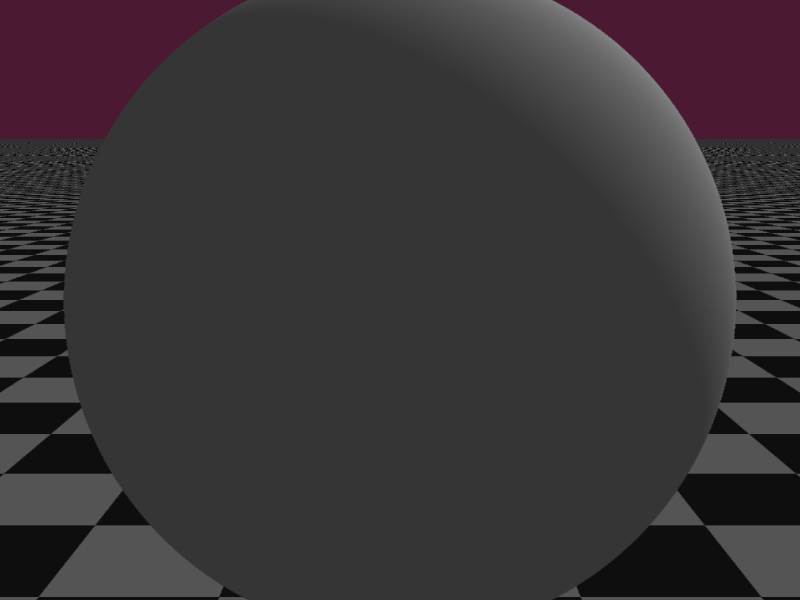
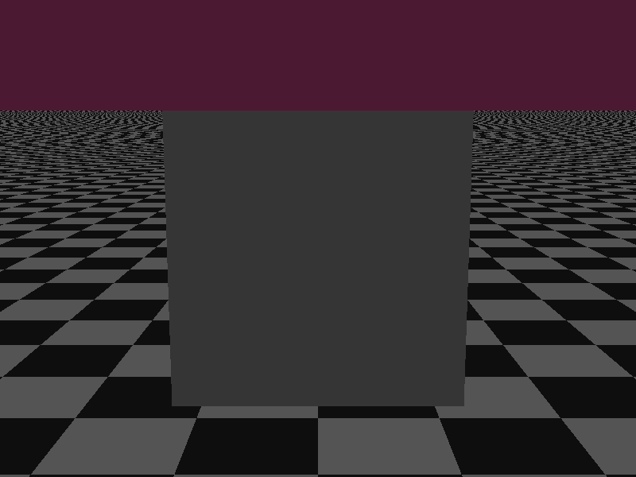
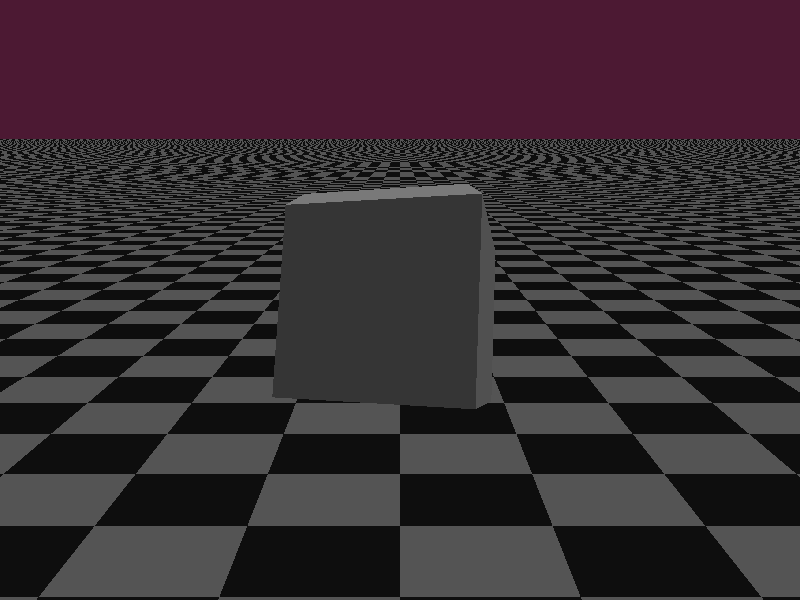
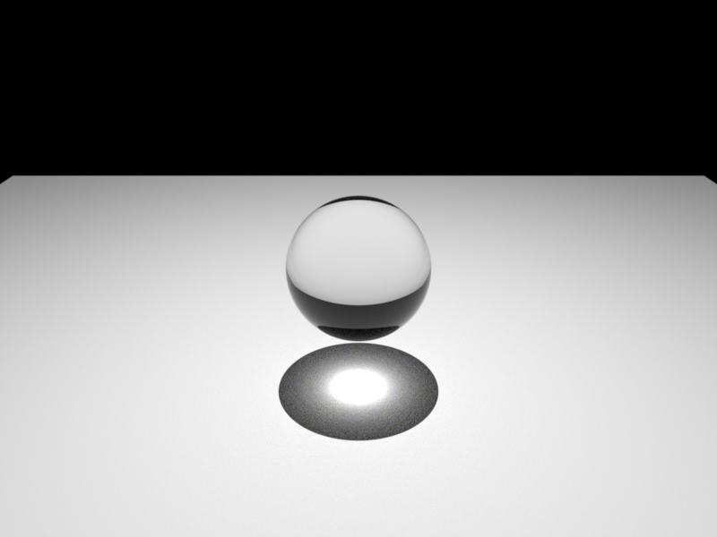

# Gallery

Sample renders produced by Menger with NVIDIA OptiX ray tracing.

## Menger Sponge

*Level-3 cube sponge with 4× anti-aliasing*

## Sphere

*Glass sphere with reflections and refraction*

## Cube

*Cube with directional lighting*

## Tesseract (4D projection)

*4D hypercube projected into 3D space*

## Caustics

*Caustic light patterns — physically-based reference render*
